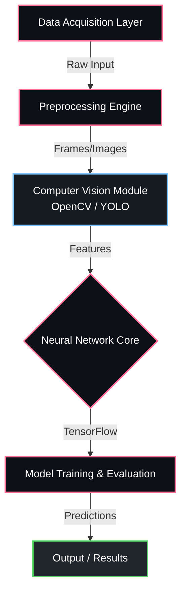

<div align="center">


<p align="center">
  
  
  
  
</p>

  
  


</div>

---

## Overview

> A machine learning / ai project comprising 311 integrated source modules, built with Python.

**AI Attendance System v1** is a proprietary machine learning / ai system engineered by **Karthik Idikuda**. It leverages OpenCV, TensorFlow for its core functionality.

<br/>

## System Architecture



<br/>

## Project Structure

```
AI-Attendance-System-v1/
  .DS_Store
  ALL_ISSUES_FIXED_FINAL.md
  ALL_SYNTAX_ERRORS_FIXED_FINAL.md
  ANTI_SPOOF_FIX_COMPLETED.md
  ANTI_SPOOF_FIX_SUMMARY.md
  AUTOMATIC_RELOAD_SYSTEM.md
  AUTOMATIC_RELOAD_SYSTEM_FIXED.md
  COMPLETE_INTEGRATION_SUCCESS.md
  DEPENDENCY_FIXES_COMPLETED.md
  DUAL_CAMERA_IMPLEMENTATION_SUMMARY.md
  .clj-kondo/
  .lsp/
  .vscode/
    c_cpp_properties.json
    launch.json
    settings.json
  __pycache__/
    demo_complete_liveness_system.cpython-38.pyc
    launch_clean_liveness_system.cpython-38.pyc
    launch_clean_liveness_system_fixed.cpython-38.pyc
    launch_final_clean.cpython-38.pyc
    launch_liveness_attendance_system.cpython-38.pyc
  data/
  models/
  src/
  tests/
```

<br/>

## Technical Specifications

| Attribute | Detail |
|:---|:---|
| **Primary Language** | `Python` |
| **Project Category** | `Machine Learning / AI` |
| **Total Source Files** | `311` |
| **Frameworks** | `OpenCV`, `TensorFlow` |
| **Key Dependencies** | `scikit-learn` | `tensorflow` | `numba` | `requests` | `imageio` | `pandas` | `scipy` | `matplotlib` | `keras` | `numpy` | `face-recognition` | `flake8` | `python-dateutil` | `imageio-ffmpeg` | `Pillow` |
| **Intellectual Property** | `Strictly Proprietary` |

<br/>

## STRICT LEGAL WARNING & LICENSE

> **PROPRIETARY AND CONFIDENTIAL**

This software and all associated documentation are the **exclusive property of Karthik Idikuda**.

- **NO PERMISSION IS GRANTED** to use, copy, modify, merge, publish, distribute, sublicense, or sell copies of this software without explicit, written consent from the author.
- **UNAUTHORIZED USE WILL RESULT IN SEVERE LEGAL ACTION.** Any individual or organization found using, referencing, or deploying this code without paying the required licensing fees will face immediate litigation, financial penalties, and potentially criminal prosecution where applicable by law.
- **TO OBTAIN A LEGAL LICENSE**, you must directly contact Karthik Idikuda to negotiate payment terms.

*By accessing this repository, you acknowledge and accept these strict proprietary terms.*

---

<div align="center">
  
</div>

<!-- TRACKING: S0ktQUktQXR0ZW5kYW5jZS1TeXN0ZW0tdjEtVFJBQ0s= -->
